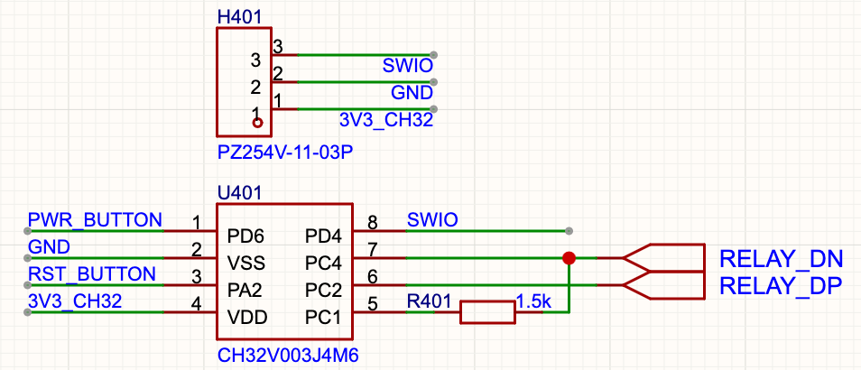

# LCUS USB HID Relay

This is a USB HID relay that can control 2 lines. The instructions are compatible with the LCUS USB relay, as shown in the photo below. I designed it for [OneKVM](https://docs.one-kvm.cn/).

Special thanks to [rv003usb](https://github.com/cnlohr/rv003usb) for creating the USB HID library, which allows me to run USB HID on the CH32V003J4M6. This chip has only 8 pins and does not integrate USB peripherals. Thanks also to the [PiKVM](https://github.com/pikvm/pikvm) Python script, which made testing possible.

USB HID reported (device to PC) that it has not been tested and may not function properly.

# How to use

You can download the firmware in the [release](https://github.com/Deadline039/lcus-hid-relay/releases). Then you need to use WCH-LinkE to download. Reference: [WCH-Link User Manual](https://akizukidenshi.com/goodsaffix/WCH-LinkUserManual.pdf)

# How to build

First, you need to install the toolchain. You can refer to [this wiki page](https://github.com/cnlohr/ch32fun/wiki/Installation).

Then, go to the `hid-relay` folder. You can run `make` to build and download (make sure your WCH-LinkE and chip are connected), or run `make build` to build only.

Finally, enjoy! You can use `test.py` to test it. For example: `python3 test.py 0 on`

# Schematic

I configured PC2 for USB_D+, PC4 for USB_D-, and PC1 for USB_DPU.

Additionally, PA1 and PA2 are output pins controlled by HID data. PD4 is reserved for debugging and downloading.

The reference schematic is shown below.

# HID Instructions

The USB ID: 5131:2007

Send data (PC to device):

| Index  | Data      | Note                                                                                                                     |
| ------ | --------- | ------------------------------------------------------------------------------------------------------------------------ |
| Byte 0 | 0xA0      | Start flag                                                                                                               |
| Byte 1 | 0x00-0xFF | Switch index, which switch will be used. You can modify the code to specific the IO.                                     |
| Byte 2 | 0x00-0x05 | 0x00: OFF, 0x01: ON, 0x02: ON with feedback, 0x03: OFF with feedback, 0x04: toggle with feedback, 0x05: check the status |
| Byte 3 | Checksum  | (byte[0] + Byte[1] + Byte[2]) % 0x100                                                                                    |

Report data (device to PC. Not test):

| Index  | Data       | Note                                  |
| ------ | ---------- | ------------------------------------- |
| Byte 0 | 0xA0       | Start flag                            |
| Byte 1 | 0x00-0xFF  | Switch index.                         |
| Byte 2 | 0x00, 0x01 | 0x00: OFF, 0x01: ON                   |
| Byte 3 | Checksum   | (byte[0] + Byte[1] + Byte[2]) % 0x100 |
