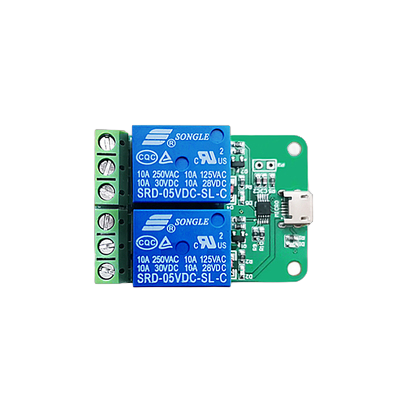
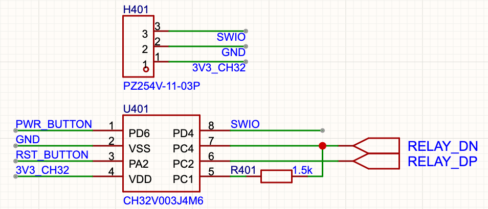

# LCUS USB HID Relay

This is a USB HID relay that can control 2 lines. The instructions are compatible with the LCUS USB relay, as shown in the photo below. I designed it for [OneKVM](https://docs.one-kvm.cn/).



Special thanks to [rv003usb](https://github.com/cnlohr/rv003usb) for creating the USB HID library, which allows me to run USB HID on the CH32V003J4M6. This chip has only 8 pins and does not integrate USB peripherals. Thanks also to the [PiKVM](https://github.com/pikvm/pikvm) Python script, which made testing possible.

# How to use

You can download the firmware in the [release](https://github.com/Deadline039/lcus-hid-relay/releases). Then you need to use WCH-LinkE to download. Reference: [WCH-Link User Manual](https://akizukidenshi.com/goodsaffix/WCH-LinkUserManual.pdf)

# How to build

First, you need to install the toolchain. You can refer to [this wiki page](https://github.com/cnlohr/ch32fun/wiki/Installation).

Then, go to the `hid-relay` folder. You can run `make` to build and download (make sure your WCH-LinkE and chip are connected), or run `make build` to build only.

Finally, enjoy! You can use `test.py` to test it. For example: `python3 test.py 1 on`


# Schematic

I configured PC2 for USB_D+, PC4 for USB_D-, and PC1 for USB_DPU.

Additionally, PA1 and PA2 are output pins controlled by HID data. PD4 is reserved for debugging and downloading.

The reference schematic is shown below.



# HID Instructions

The USB ID: 5131:2007

Send data (PC to device):

| Index  | Data      | Note                                                                                                                     |
| ------ | --------- | ------------------------------------------------------------------------------------------------------------------------ |
| Byte 0 | 0xA0      | Start flag                                                                                                               |
| Byte 1 | 0x01-0x02 | Channel 1 is PA1; channel 2 is PA2.                                     |
| Byte 2 | 0x00-0x05 | 0x00: OFF, 0x01: ON, 0x02: OFF with feedback, 0x03: ON with feedback, 0x04: toggle with feedback, 0x05: check the status |
| Byte 3 | Checksum  | (byte[0] + Byte[1] + Byte[2]) % 0x100                                                                                    |

Report data (device to PC):

| Index  | Data       | Note                                  |
| ------ | ---------- | ------------------------------------- |
| Byte 0 | 0xA0       | Start flag                            |
| Byte 1 | 0x01-0x02  | Switch index.                         |
| Byte 2 | 0x00, 0x01 | 0x00: OFF, 0x01: ON                   |
| Byte 3 | Checksum   | (byte[0] + Byte[1] + Byte[2]) % 0x100 |


## HID transport and feedback

USB directions are named from the host's perspective: **OUT** sends commands to the relay; **IN** reads feedback from the relay.

- Interrupt OUT endpoint `0x02`: four-byte commands.
- Interrupt IN endpoint `0x81`: four-byte status reports, polled every 10 ms.
- The HID descriptor declares four-byte Input, Output, and Feature reports without Report IDs. HIDAPI `write()` and `send_feature_report()` require a leading zero Report ID in the API buffer: `[0x00, 0xA0, channel, command, checksum]`. The USB payload is the final four bytes. `read(4, timeout)` returns the four-byte Input report directly.
- Control endpoint SET_REPORT also accepts four-byte Output/Feature commands. GET_REPORT (Input/Feature, ID 0) returns the latest valid command's status, or four zero bytes before any command.
- Commands `0x00` and `0x01` change the output without queuing an Input report. Commands `0x02`–`0x05` each queue one status report. Idle IN polls receive NAK; a report remains available for retransmission until acknowledged by the host.
- Send one feedback command and read its response before sending the next. Up to eight reports are buffered; when full, additional feedback commands are ignored without changing the output. Malformed commands are ignored.
- Feedback samples the GPIO level after executing the command; it does not verify mechanical relay contact position.

Install the Python `hidapi` package, flash the new firmware, and reconnect the USB device so the host reads the updated descriptors. Examples:

```sh
python3 test.py 1 on-feedback
python3 test.py 1 status
python3 test.py 2 toggle
python3 test.py 1 off-feedback
```

The existing `on` and `off` commands remain available and do not wait for feedback.
